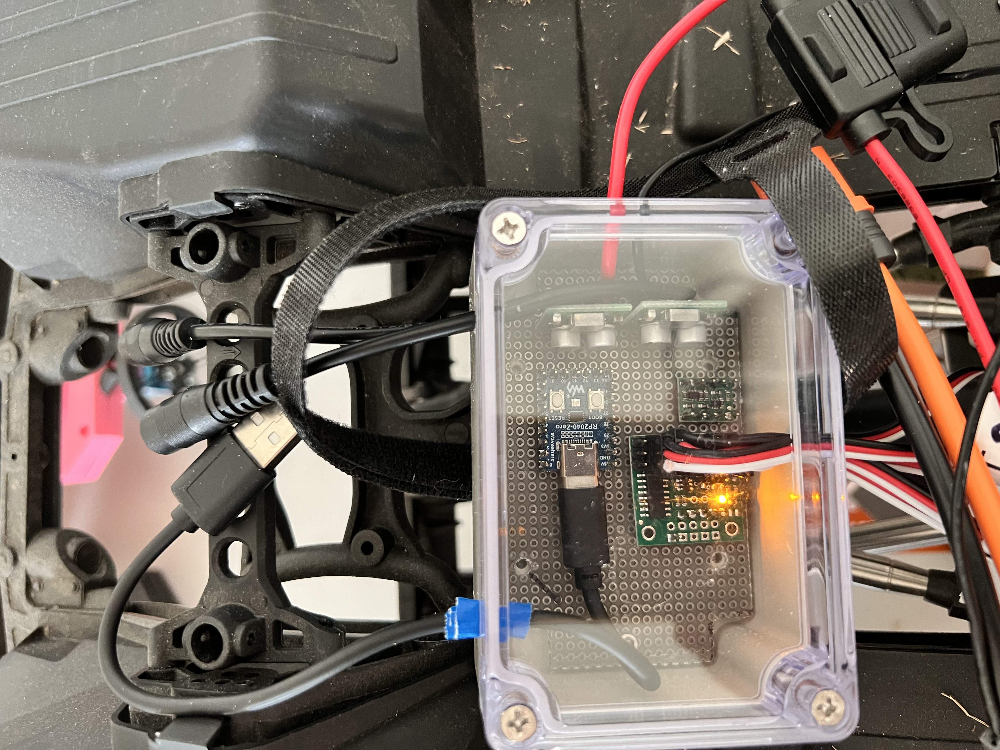
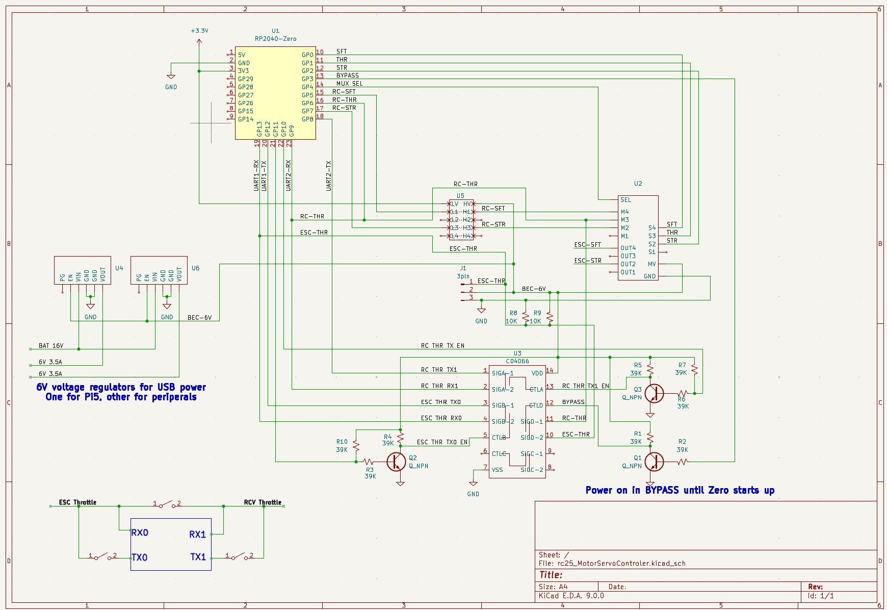
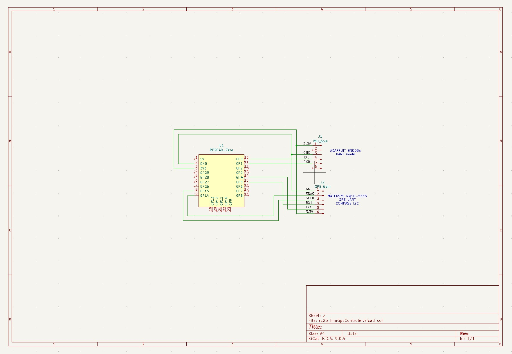
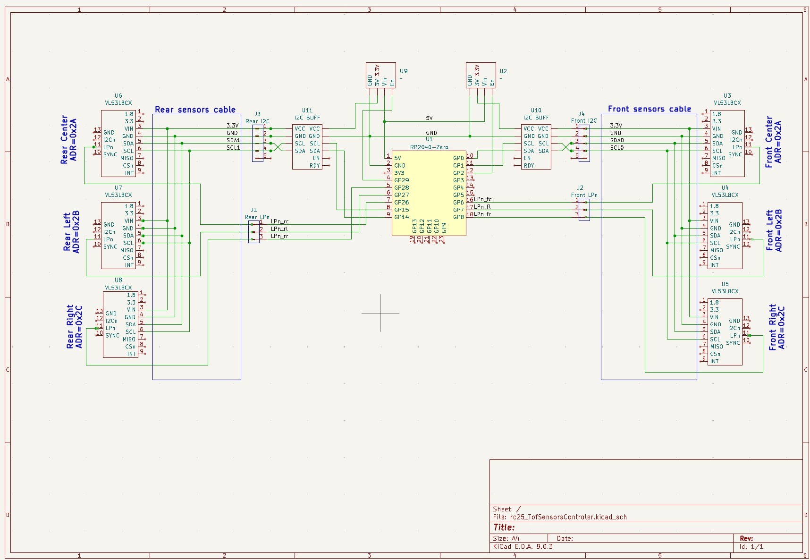
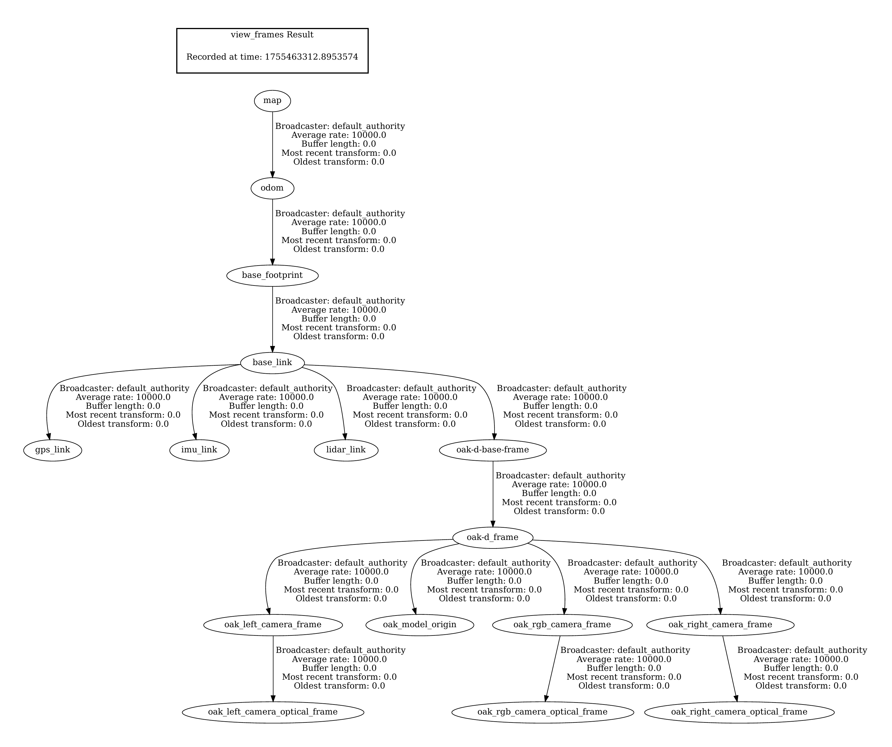
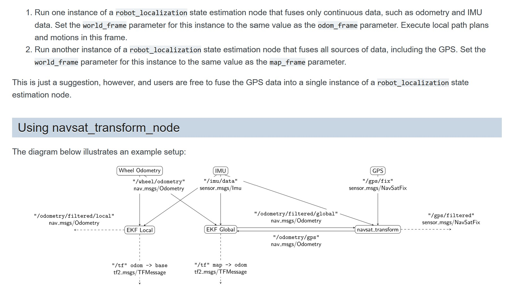

# RoboColumbus2025
Wheeled autonomus robot for 2025 DPRG RoboColumbus competion

This project was started in June 2024 and is expected to have a competitive robot for the RoboColumbus competition in Fall of 2025. I will drive the robot around the field in The Fall of 2024 and maybe have odometry and mapping displayed using ROS2 Rviz2 and Foxglove. 
!Update: Got zero points at 2025 competion it never moved from start line stuttering resuming navigation to way point. 
The logs said that it could not plan to the waypoint it was too far. 
I eventually found the issue in the rc25_params file: The global map was 100x100 meters meaning it could only plan up to +-50 meters in any direction. My testing waas below 50 meters!
https://www.dprg.org/robocolumbus-2025/

# RoboColumbus competition
The basic objective for RoboColumbus are:
-Three orange cones, designated as home, target, and challenge, are placed
outdoors approximately 100 yards from each other. The course between the home cone and the
target cone is clear of obstacles. The course between the challenge cone to both the home
cone and the target cone contains at least one obstacle that requires the robot to deviate from a
direct path. The challenge is to touch and stop at each cone.
- If multiple contestants find and touch the same number of cones then the total time is used to select the winner.
- Robots run on a field of grasses and some tree/bushes boxes etc for obsticles to avoid. Some pavement is OK.
- GPS coordinates of the 3 traffic cones in the field are provided. There should be obsticals between some of the cones. The owner can create GPS coordinates to avoid obsticles.
- The cones are orange and about 17" high and 7" diameter.
- Robots are NOT allowed on the field before competition.
- Run times are less than 15 Minutes
- Robots checked for weight(65 lbs), size(48x48x60 in), and safety switch compliance.

(https://www.dprg.org/wp-content/uploads/2024/06/robocolumbusplus-20240611-1.pdf)

# Robot platform
The AXIAL RCX6 1/6 scale Jeep rock crawler platform was selected to be used for the robot. This platform allows generous room for sensors and electronics to be added and can be installed into the interior of the Jeep for protection.
https://www.axialadventure.com/product/1-6-scx6-jeep-jlu-wrangler-4x4-rock-crawler-rtr-green/AXI05000T1.html 

The motor drive, steering and shift control signals must be multiplexed between the RC receiver and the computer. A module in the engine compartment will be added to perform this with a serial interface to the computer in the Jeep cabin. The RC receiver is powered from the motor controller (facrory default) and the connections to the computer is optional, the module will power up to use the RC receiver signals. 

The main battery in the engine compartment will also be used for sensors and computer power. A DC-DC module would be added in the engine compartment with 2 sets of 5V at 3 Amps power leads to the Jeep cabin. Fusing the power from the main battery is added for protection. The control multiplexor and DC converter on one board.

# Power
Tap from 1 or 2 3S 11.1V LiPo battery in engine compartment with a fuse. The batteries can be hot swapped.
Two DC-DC converters/regulators for computer and sensors in sealed box in engine compartment.
Also a 5mm/2.5 power jack for external power, hot plugable.

# Remote connectivity
- RC transmitter for selecting the recevier or computer  
  When the computer is selected it is used as a kill switch  
  When receiver is selected it is used for manual steering control  
- Game controller with drive controls and start and kill buttons. 
- WIFI for development and debug and course configuration  
- Tiger VNC server on Pi ; Tiger VNC Viewer on PC 192.168.1.155 
Tiger VNC viewer must be started from .exe file

# Sensors
## GPS
GPS receiver with optional RTK capbility Used for primary odometry 
This is a standard GPS with many meters of in-accuracy. 
U-Blox M10Q

## IMU
IMU BNO085 to provide tilt compensation for sensors and maybe bearing to help GPS 
## Camera
Object detection (Coneslayer AI package) and depth camera OAK-D-Lite
## LIDAR
Optional rotating LIDAR SLLIDAR S3 for far obsticle detection and avoidance
## TOF
Time Of Flight sensors on front, rear and optional sides with mm resolution for close obstical avoidance and close cone sensor 
There are 3 VL53L8CX on both front and back giving a total FOV of 45x135 deg with an array of 8x24 distance measurements 
# Computer 
- Raspberry Pi with OS Ubuntu 24.04 and a 225G SSD 

# Software
## ROS2
- Using ROS2 Jazzy which requires Linux Ubuntu 24.04 OS
- Ubuntu 24.04 is running natively on the SSD
- The ROS software package in the rc25_ws directory is published on https://github.com/mikew123/rc25_ws.git

## 3rd party ROS2 
These packages are used for the Lidar and cone detection on the OAK-D-Lite camera. They are cloned into the home directory.
- Cone detection AI
https://github.com/mw46d/ros_coneslayer.git
- Lidar management
https://github.com/Slamtec/sllidar_ros2.git

# Electronic modules
## Servo switch
This switches the servo and engine ESC signals between the RC receiver and the computer 
Pololu 2807 4-Channel RC Servo Multiplexer (Partial Kit) 
<https://www.pololu.com/product/2807>
## DC-DC converter
This supplies power for the cabin electronics. The 6V allows a protection diode while keeping the voltage above 5V 
Pololu 6V, 2.7A Step-Down Voltage Regulator D36V28F6 
<https://www.pololu.com/product/3783>
## Level shifter
This protects the 3.3V input pins on the micro controller from the 6V signals from the RC receiver 
Pololu Logic Level Shifter, 4-Channel, Bidirectional 2595 
<https://www.pololu.com/product/2595>
## Microcontroller
Uses 3 Waveshare RP2040-Zero, a Pico-like MCU Board Based on Raspberry Pi MCU RP2040, Mini ver. 
<https://www.waveshare.com/rp2040-zero.htm> 
- Messages are formatted as Json strings messages over serial. Each controller is selected using /dev/serial/by-id/"..." when opening the serial point on a ROS node 
- Engine controller: selects between the computer in the cabin and the RC receiver. It also relays the steering, throttle and shift signals from the computer and the servos and motor ESC. It also allows the computer to set default ranges etc, and sends statuses back. 
- IMU GPS controller: collect the IMU and front and back TOF sensor data and send to the ROS node over serial 
- TOF controller: Collects the TOF sensor values and sends them to the ROS node over serial 

# New electronics in engine compartment
A waterproof box is mounted to the rear battery holder. This box holds the DC-DC converters for the electronics in the cabin, the servo signal mux and a micro controller to manage the servo switch and send some telemetry to the computer in the cabin. The servo switch defaults to connecting the RC receiver to the motor and servos. 

## Method to switch to computer control
The steering wheel and speed switch on the RC transmitter is used to switch to-from computer control. This must be done with throttle at idle.
- Switch to computer control: Turn steering left (CCW) and press speed switch DN(high) then UP (low)
- Switch to receiver control: Turn steering right and press speed switch DN then UP
## Electronics boards
### Engine Controller Board
The electronic module is connected using soldered wires and a 0.1" breadboard cut to fit the waterproff box interior
The RC receiver signals are connected to the MASTER pins of the RC switch module using standard servo cables
The motor and servo signals are connected to the OUT pins of the RC switch module using standard servo cables
The controler pins are hard wired to the SLAVE pins of the RC switch
The controller USB supplies the power only to the micro controller 
The DC-DC converters are inside the waterproof box. The power input from the battery has an in-line fuse which is not in the box to protect the batteries from an electrical short. 
 
 
 

### IMU and GPS Controller Board
 

### TOF Sensors Controller Board
 

### Battery/external power Board
This board uses Schotky diodes to Isolate the extarnal power from the Regulated power regulators in the engine compartment (connected to the battery) 
The power sources can be hot swapped withoout shutting down the Pi 

# Micro controller firmware
The microcontroller firmware is C-code developed using the Arduino IDE. The interface to the controller uses the USB port for a serial communications interface. A simple Json data structure sends data to-from the computer in the cabin over the USB serial interface.
### IMU & GPS Controller (RP2040)
Uses a dual-core RP2040 microcontroller to collect IMU (BNO085) and GPS (U-Blox M10Q) data.
- **Core 1:** Polls and processes IMU and GPS sensor data, formats, and sends JSON messages over USB serial to the host computer.
- **Core 2:** Buffers sensor data and passes it to core 1 for transmission.
Data is formatted as JSON and sent over USB serial. The inter-core buffer ensures reliable, low-latency transfer of sensor packets to the host computer for real-time robot localization and navigation.
**Sensor libraries used:**
- Adafruit BNO08x (IMU)
- SparkFun u-blox GNSS v3 (GPS)

### TOF Controller (RP2040)
Uses both cores of the RP2040 microcontroller to manage Time-of-Flight (TOF) sensor data.
- **Core 1:** Polls and processes data from the front cluster of three TOF sensors, formats, and sends JSON messages over USB serial to the host computer.
- **Core 2:** Polls and processes data from the rear cluster of TOF sensors, buffers distance measurements, and passes them to core 1 for transmission.
Front and rear TOF devices are connected to separate I2C interfaces (`Wire` and `Wire1`).
A serial queue is used for inter-core communication, allowing core 2 to send data to core 1 for transmission.
Sensor data validity is filtered using the status message from each TOF sensor, ensuring only reliable measurements are sent. The controller uses the VL53L8CX TOF sensor library for sensor interfacing and data acquisition.
This design enables efficient, parallel acquisition and low-latency transfer of TOF sensor readings for real-time processing.
### Engine Controller Firmware (RCX6-engine-ctrl-SRXL2)
Controls engine, steering, and shift functions for the RCX6 robot using SRXL2 serial protocol. Handles multiplexing between RC receiver and computer control, relays commands, and manages telemetry.

#### Main Firmware (`RCX6-engine-ctrl-SRXL2.ino`)
- Initializes hardware, sets up serial communication, and manages the main control loop.
- Handles switching between RC and computer control modes.
- Processes incoming JSON commands and relays them to the appropriate subsystems.

#### PWM Control (`rcxpwm.cpp`, `rcxpwm.h`)
- Implements PWM signal generation and decoding for motor, steering, and shift channels.
- Provides functions to read and write PWM values for both RC and computer control.
- Manages safe switching and signal integrity.

#### SRXL2 Protocol (`srxl2.cpp`, `srxl2.h`, `srxl2Structs.h`)
- Implements the SRXL2 serial protocol for communication with Spektrum ESC and telemetry devices.
- Defines SRXL2 message structures and parsing logic.
- Handles bidirectional UART communication, message encoding/decoding, and telemetry extraction.

#### Libraries Used
- Arduino core libraries
- SRXL2 protocol library (custom implementation)
- Standard C++ libraries for data structures and serial communication
**Sensor libraries used:**
- Arduino VL53L8CX (TOF)
- Arduino_JSON
## RC switch interface
### Outputs to RC switch
- Slave select
- Steering servo
- Motor speed/fwd-rev
- High-Low speed select servo
### Inputs from RC switch
- Steering
- High-Low speed select
## Decode RC receiver Steer and Shift PWm signals
### Switch to/from computer control
- From receiver 
Enable computer control: Steering CW, toggle Shift DOWN then UP 
Enable receiver control: Steering CCW, toggle Shift DOWN the UP 
- From computer 
Send JSON message 
### Kill switch
The remote control transmitter can be used as a "kill" switch to stop and resume robot movements. The kill switch operation can be used when the engine controller is controlled by the computer in "cv" mode. Turning off the remote transmitter or switching out of "cv" mode disables the kill switch and it must be re-enabled next time it is in "cv" mode 
The engine must be in computer control mode "cv": 
The shift action is to press the shift switch up the down. 
- Enable kill switch: Pull trigger and shift 
- Disable kill switch: Change mode or power transmitter OFF 
- Latch the kill switch: While enabled and trigger is pulled and shift then release trigger 
- Unlatch the kill switch: Pull the trigger (must re-latch if desired) 

While the kill switch is enabled releasing the trigger will stop any movement. Pulling the trigger will resume movement. Changing mode or powering the transmitter OFF will disable the latch. 

## JSON messages
### Congfigure messages from the computer
- Switch to/from computer control modes 
{"mode":"bypass"}: Use remote Rc transmitter to control the robot directly  
{"mode":"passthru"}: Use remote Rc transmitter to control the robot indirectly  
{"mode":"cv"}: Control robot using fwd velocity and steering angle 
{"mode":"pct"}: Control robot using Steering and throttle percents  
### Runtime control messages from computer
When powered on the throttle and steering are from the receiver. They can be switched to the computer with a JSON command or from controls on the receiver 
#### Computer control using percent
The mode must be "pct":
- Throttle 
{"thr":pct} percent throttle, forward +pct, reverse -pct 
- Steer 
{"str":pct} percent steering, right +pct, left -pct 
- Gear shift 
{"sft":bool} Gear shift, high true, low false 
#### Computer control using velocity and angle
The mode must be "cv":
-{"cv":[velocity, steer]}
Velocity in meters per second 
Steering in radian angles (+-40 degrees)

### Status messages to computer
## Throttle bidir half duplex serial messages
The Throttle interface between the RC receiver and the ESC controller is a bidirectional UART serial interface at 155200 baud. The RC receiver sends control signals to the ESC. The ESC responds with telemetry data to the RC receiver. 
The devices power on with the RC <-> ESC Throttle in BYPASS mode, the Zero can disable BYPASS and receive the serial data from both the RC and the ESC. The Zero can enable serial TX to both the RC and ESC between RX messages to impliment the half duplex. 

https://github.com/SpektrumRC/SRXL2

https://github.com/SpektrumRC/SRXL2/blob/master/Docs/SRXL2%20Specification.pdf

https://github.com/SpektrumRC/SpektrumDocumentation/blob/master/Telemetry/spektrumTelemetrySensors.h

# Velocity control

The Spektrum ESC motor speed control is in percent throttle. It seems like any Throttle value less than 21 does not activate the motor so the range seems to be about 20 to 100 where 20 is 0 RPM. Reverse seems to be about the same -20 to -100. 
An early test plot of Throttle vs Rpm and Velocity(M/S): 

 
The sample rate is 10Hz and there are 10 values for each throtthe value 20 to 100 
Throttle is not scaled but offset by 20 so the plot range is 0 to 80 for actual values of 20% to 100%. Velocity Mps is scaled by 100 to graph well. Motor Rpm is scaled by 0.055. 
The motor RPM extracted from the ESC telemetry as basically linear with Throttle but has steps so is not very usable. The Velocity Meters/Second is very linear with Throttle except at the upper throttle values above 90% (70 on plot) where it tapers off a bit. The velocity has some noise, it might be caused by the "bumps" on the omni wheel of the GoBuilda Pod Wheel encoder that I used measure the rottaion of the drive shaft by pressing against it. 
The plotted velocity Mps was calculated as (millisDiff/1000)/(odomDiff/5,615). The scale factor of 5,615 was determined my measuring the circumference of the tire (~570mm) and reading the odom encoder change after the tire rotates 10 times. (The throttle was set to 25% and the time it was running tweaked to get exactly 10 rotations.) 
 
This is a detail view of the first 200 samples:
 

# ROS code
### Teleoperation Node — `robocolumbus25_teleop_node.py`

- **Purpose:** Converts joystick input into robot motion and simple JSON control messages.
- **Subscribes:** `/joy` (`sensor_msgs/Joy`), `json_msg` (`std_msgs/String`).
- **Publishes:** `/cmd_vel/teleop` (`geometry_msgs/Twist`), `json_msg` (`std_msgs/String`).
- **Behavior:** Maps joystick axes to throttle (axis 1) and steering (axis 3), applies configured
  max linear speed and steering limits, computes `angular.z` from steering using wheelbase geometry
  (angular.z = tan(steer_angle) * linear_x / wheel_base), publishes `cmd_vel` when joystick moved,
  and emits button-change JSON messages for kill/do events. Sends an initial TTS JSON message
  "Teleop Node Started" at startup.
- **Quick run:** Launch as part of your ROS2 workspace or run the script directly with the ROS2
  environment sourced (it contains a `main` so it can be executed with `python3`).

### Speaker Node — `robocolumbus25_speaker_node.py`

- **Purpose:** Listens for JSON `json_msg` and speaks text via `espeak`.
- **Subscribes:** `json_msg` (`std_msgs/String`) — expects `{"speaker":{"tts":"..."}}`.
- **Publishes:** `json_msg` (`std_msgs/String`) — e.g., startup TTS messages.
- **Behavior:** Parses incoming JSON, logs and runs `espeak -a <volume> "<text>"` for `tts` entries; default `volume=200`. Contains a runnable `main` allowing direct execution.

### Cone Node — `robocolumbus25_cone_node.py`

- **Purpose:** Detects cones from camera and LIDAR, validates detections, and publishes cone positions.
- **Subscribes:** `/color/spatial_detections` (`vision_msgs/Detection3DArray`), `/scan` (`sensor_msgs/LaserScan`), `/json_msg` (`std_msgs/String`).
- **Publishes:** `/cone_point_cam` (`geometry_msgs/PointStamped`), `/cone_point_lidar` (`geometry_msgs/PointStamped`), `/json_msg` (`std_msgs/String`).
- **Behavior:** Filters and validates camera detections (bounding-box checks + median-7 distance filter) and processes LIDAR scans to find cone-like clusters using distance-jump detection and width/ratio validation; publishes detected cone coordinates in appropriate TF frames (`oak-d_frame`, `lidar_link`) and emits TTS/status JSON when sensors activate or lose track.

### TOF Node — `robocolumbus25_tof_node.py`

- **Purpose:** Publishes point clouds and raw distance arrays from serial-connected RP2040 TOF sensors (front/rear, left/center/right).
- **Subscribes:** `json_msg` (`std_msgs/String`).
- **Publishes:** `tof_fc`, `tof_fl`, `tof_fr`, `tof_rc`, `tof_rl`, `tof_rr` (`sensor_msgs/PointCloud2`), `tof_fc_mid` (`rc25_interfaces/Float32X8`), `tof_dist` (`rc25_interfaces/TofDist`), `json_msg` (`std_msgs/String`).
- **Behavior:** Reads JSON packets for each TOF sensor, publishes 8x8 point clouds (with curvature correction) and raw distance arrays, and emits TTS/status messages at startup.

### Wheel Controller Node — `robocolumbus25_wheel_controler_node.py`

- **Purpose:** Controls rear wheel velocity and front steering angle for the Jeep robot using Ackermann steering. Arbitrates between `/cmd_vel` (from ROS2 navigator) and `/cmd_vel/teleop` (from teleop node); teleop commands take priority for 1 second after receipt, blocking navigation commands during that time.
- **Subscribes:** `/cmd_vel` (`geometry_msgs/Twist`), `/cmd_vel/teleop` (`geometry_msgs/Twist`), `json_msg` (`std_msgs/String`).
- **Publishes:** `wheel_odom` (`nav_msgs/Odometry`), `json_msg` (`std_msgs/String`).
- **Behavior:** Converts velocity/steering commands to Ackermann steering, arbitrates between teleop and navigation, sends commands to engine controller via serial JSON, processes wheel encoder odometry, and emits TTS/status messages at startup and on state changes.

### Navigation Node — `robocolumbus25_nav_node.py`

- **Purpose:** Autonomous navigation to waypoints and cones using GPS, IMU, camera, LIDAR, and TOF sensors.
- **Subscribes:** `/cone_point_cam`, `/cone_point_lidar`, `/tof_fc_mid`, `/tof_dist`, `/gps_nav`, `/json_msg`.
- **Publishes:** `/cmd_vel`, `/set_pose`, `/json_msg`.
- **Behavior:** State machine for calibration, waypoint navigation, cone detection/approach, and backup. Reads waypoints from YAML, configures navigation parameters, and coordinates with other nodes via JSON messages and TTS.

### Controller Node — `robocolumbus25_controller_node.py`

- **Purpose:** Controls overall robot navigation and status. Listens for engine status JSON messages, manages battery status publishing, and coordinates pose setting. Publishes TTS/status messages and interacts with other nodes via `json_msg`.
- **Subscribes:** `json_msg` (`std_msgs/String`)
- **Publishes:** `battery_status` (`sensor_msgs/BatteryState`), `set_pose` (`geometry_msgs/PoseWithCovarianceStamped`), `json_msg` (`std_msgs/String`)
- **Behavior:** Processes engine status messages, manages battery status, sets robot pose, and coordinates TTS/status communication with other nodes.

### IMU & GPS Node — `robocolumbus25_imu_gps_node.py`

- **Purpose:** Reads JSON sensor packets from a serial-connected RP2040 and publishes standard ROS2 IMU/GPS messages.
- **Subscribes:** `json_msg` (`std_msgs/String`), `gps_nav` (`sensor_msgs/NavSatFix`).
- **Publishes:** `imu` (`sensor_msgs/Imu`), `imu/cal` (`rc25_interfaces/ImuCal`), `gps_nav` (`sensor_msgs/NavSatFix`), `gps_pose` (`geometry_msgs/Pose`), `cmp_azi` (`std_msgs/Float32`), `json_msg` (`std_msgs/String`).
- **Behavior:** Opens the serial device, parses incoming JSON lines for `imu`, `gps`, and `cmp` packets. Publishes `sensor_msgs/Imu` constructed from rotation vectors, angular velocity and linear acceleration; publishes `NavSatFix` for GPS with covariance and local `gps_pose` offsets; publishes calibration `ImuCal` messages and compass azimuth (`cmp_azi`). Sends configuration commands to the serial controller and emits simple JSON status messages on `json_msg`.

### Custom Interface Messages — `rc25_interfaces/msg`

- **Float32X8.msg:** Array of 8 float32 values, used for publishing TOF sensor distance data and similar multi-value sensor outputs.
- **ImuCal.msg:** IMU calibration status and data, typically includes fields for calibration state, progress, and results from the robot's IMU.
- **TofDist.msg:** Structured TOF sensor distance data, includes sensor identifier and a 64-element float32 array for detailed distance measurements from TOF sensors.

## 3rd party ROS packages used
The Lidar is managed using the https://github.com/Slamtec/sllidar_ros2.git package 
The Camera cone detection AI uses the https://github.com/mw46d/ros_coneslayer.git package 
The 3rd party libraries are used by launching them within the rc25 launch file 

## TF link map
The oak-d physical component TF frames are created in ros_coneslayer and connected to in the URDF file 
The complete TF frame map (pdftoppm -png rc25_08_17_25.pdf rc25_08_17_25): 
 

## Waypoints
The way points are set using a YAML formated waypoints file. The starting pose and waypoints can be in either X,Y or lat/lon format. The GPS can be enabled or not. The waypoints file are in the /sambashare directory so that the PC can easily acces them remotely 

## Using GPS
https://docs.ros.org/en/melodic/api/robot_localization/html/integrating_gps.html 
 
I ended up connecting the odometry output of the EFK local node to the EFK global (GPS) node instead of connecting EFK global to IMU and Engine odometry 
There are seperate param.yaml files for the EFK_local, EFK_global and navsat_transform nodes<>
The AMCL node is disabled in the nav2 params file, but needed to set some other parameters to make AMCL happy. 
The navsat_transform creates the map->odom TF for localization correction using GPS. 
### GPS ROS odd stuff
I had to set the GPS datum in the navsat_transform params even though I set wait_for_datum: true!! It must be relatively close to the actual GPS waypoints location. Example: I set the datum in the file to my house in Dallas for testing, but that was not close enough for the competition in Farmersville!! 
I got best results updating the dataum param with actual GPS value read from the reciever at the initial position 
The nav2 navigation needs the X,Y coordinates relative to the initial position, it does not accept GPS lat,lon which are converted to X,Y meters using UTM conversions.

# TODO:
## Electrical Mechanical
### Put electronics inside jeep
- Lidar mounted on roof
- Does camaera detect cones through existing windshield?
### Other
- Improve external DC power
- Work on transmission and drive chain: noticable grease/oil and odd noises

## Code
- Detect cone while going to waypoint and then approach it before getting to waypoint
- If cone is not detected or lost detetction at waypoint go to points close by (say +-5M) if no cone is found go to next waypoint
- Avoid obstacles while "manually" searching in movement pattern for the cone 
- Convert nodes to LifeCycle

## Simulation?
- Create simulation model
- Create Gazebo height map for terrain hills and valleys
- Add odd obstacles like grass/weeds/branches to Gazebo
- Sensor sensitivity to rounded objects and small things like weeds?
- Model robot bounce caused my shock obsorbers?
  
## RTK GPS?
- Update to RTK $$
